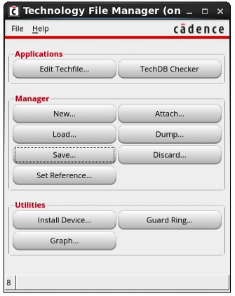
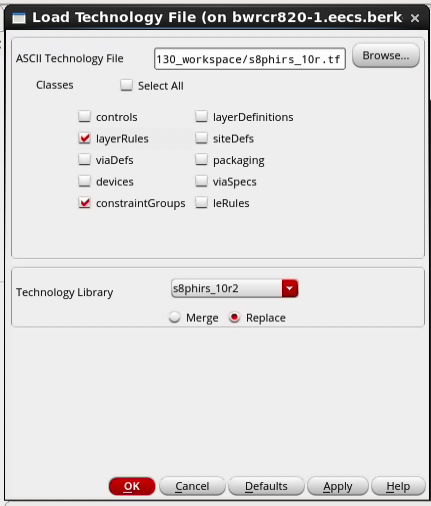

# Skywater 130 Abstract Generation

The `s8phirs_10r` tech library is somewhat broken when it comes to abstract generation as the techfile is missing some necessary fields. If you would like to generate abstract views (LEF) in sky130 through BAG or manually you have two options, one fast and one slow.

## Fast Option ⬅ (use this one)

Instead of adding `s8phirs_10r` and attaching this to your design and/or BAG output library, add and attach to the library in:

``` unix
/tools/commercial/skywater/swtech130/local/skywater-src-nda-techfile-fix/s8/V2.0.1/V2.0.1/VirtuosoOA/libs/s8phirs_10r
```

This library has a fixed techfile and tech.db such that you can now run `gen_cell.py` with the `-lef` option or just load your library into the Cadence abstract tool.

## Slow Option

The issue with the foundry techfiles is twofold:

1. The techfiles are missing the `LEFDefaultRouteSpec` constraint group
2. The mask numbers are undefined in the `layerRules` section of the techfile.

Both of these issues have to be corrected before abstract will load libraries, and if BAG’s lefgen is run without these fixes, the LEF generation completes but the resulting file is empty.

### Modifying the techfile

You will need write access to the modified library. This may involve copying the s8phirs_10r library from the original PDK location to one where you have write access.

Open Virtuoso and either make a new library and attach it to `s8phirs_10r` or pick a library that is already attached to said technology. Open the Technology File Manager from the CIW through Tools > Technology File Manager.



From here, either make a copy of the techfile in the PDK or have the Technology File Manger do it by opening the TechDB Checker, selecting `s8phirs_10r` and clicking View Techfile. This will create a new copy of the techfile in your local directory. Make the following changes to this file.

#### LEFDefaultRouteSpec

Add the correct definition of this constraint group under the `constraintGroups(` section as follows:

``` SKILL
 ;( group	[override]	[definition]	[operator] )
 ;( -----	----------	------------	---------- )
  ( "LEFDefaultRouteSpec"	nil	"LEFDefaultRouteSpec"
	
	interconnect(
		(validLayers	(poly li1 met1 met2 met3 met4 met5))
		(validVias	(TPL1_C PYL1_C L1M1_C M1M2_C M2M3_C M3M4_C M4M5_C))
	) ;interconnect
  ) ;LEFDefaultRouteSpec
```

Note that the `validVias` are defined as per the via definitions earlier in the techfile and not the via layer names.

#### layerRules

For the layer rules, we just need to add mask numbers. These don’t appear to need to correspond to any other layer maps so we can just add numbers in order as follows:

``` SKILL
layerRules(

 functions(
 ;( layer                       function        [maskNumber])
 ;( -----                       --------        ------------)
  ( pwell                    	"pwell"      	1			)
  ( nwell                    	"nwell"      	2			)
  ( diff                     	"ndiff"      	3			)
  ( tap                      	"ndiff"      	4			)
  ( poly                     	"poly"       	5			)
  ( licon1                   	"cut"        	6			)
  ( li1                      	"metal"      	7			)
  ( mcon                     	"cut"        	8			)
  ( met1                     	"metal"      	9			)
  ( via                      	"cut"        	10			)
  ( met2                     	"metal"      	11			)
  ( via2                     	"cut"        	12			)
  ( met3                     	"metal"      	13			)
  ( via3                     	"cut"        	14			)
  ( met4                     	"metal"      	15			)
  ( via4                     	"cut"        	16			)
  ( met5                     	"metal"      	17			)
  ( pad                      	"cut"        	18			)
  ( rdl                      	"metal"      	19			)
 ) ;functions

) ;layerRules
```

### Saving the Changes

In order for the changes to take effect, the techfile must be merged back into the library and saved to the tech database. From the Technology File Manager, select Load…



Add your locally modified techfile to the ASCII Technology File field, and select the layerRules and constraintGroups Classes. At the bottom, select the technology library that you have write access to. Either Merge or Replace will work here, but after confirming your settings, run the load and check the CIW for any warnings/errors.

Alternatively, if you are editing the techfile in the library directly, you can skip the steps up to this point.

Once you have loaded the techfile and merged with the tech library you will need to save it into the tech database. From the Technology File Manager, select Save… and point to the library we merged our techfile into previously.


Just hit OK here and watch the CIW for any errors/warnings. If all goes well the CIW should report that the tech library was successfully saved. Once this happens, you are all ready to use abstract generation in sky130! (Told you you should have used the fast option.)
